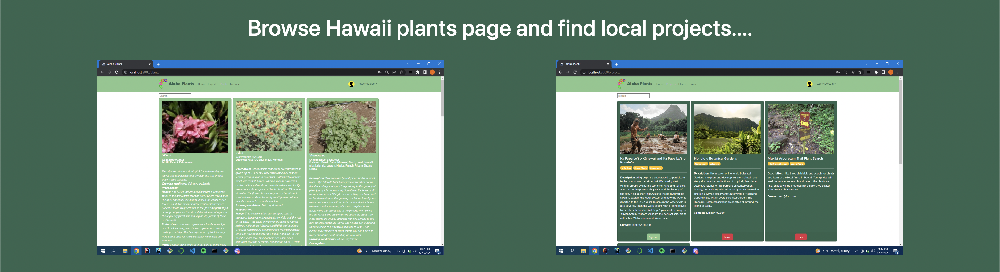
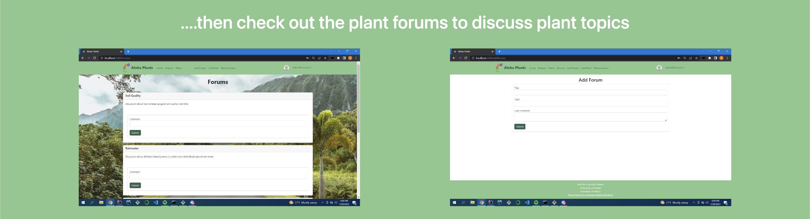
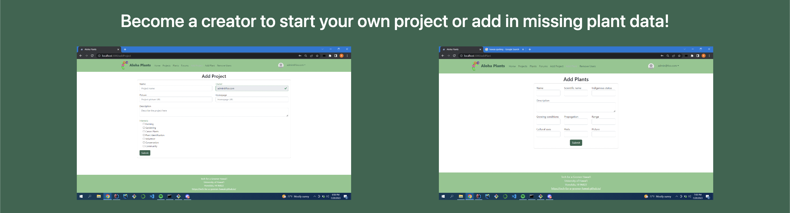

    

    

    

Hawaii was historically a hub of native biodiveristy and sustainability; however, since its colonization 90% of food is now imported to the islands. Our “Aloha Plants” website allows users to search and view different native plants, forums, and community projects. The hope is that Hawaiians will become aware of and engage in their community projects and take part in growing more food locally, thereby recaliming the islands' sustianable history.

Most of my contributions to Aloha Plants were laying the groundwork for the underlying collections that support the plants, projects, and forums pages. With these collections in place, other members of my team were able to implement site functionality such as search bars, edits, and deletes. I also made the role separation between non-users, users, and admins and made sure that with each new feature, it was viewable/accessible only by roles with the correct permissions.

My biggest takeaway from developing this site was using github's issue driven project management system. By the time the project reached its final deployment, I felt extremely confident in my ability to navigate this and similar systems in the future. Playing a critical role in development also forced me to truly understand the connection between Meteor and MongoDB when it comes to collection management.

[Source Code.](https://github.com/tech-for-a-greener-hawaii/aloha-plants)

Learn more at our [github.io](https://tech-for-a-greener-hawaii.github.io/) page.
