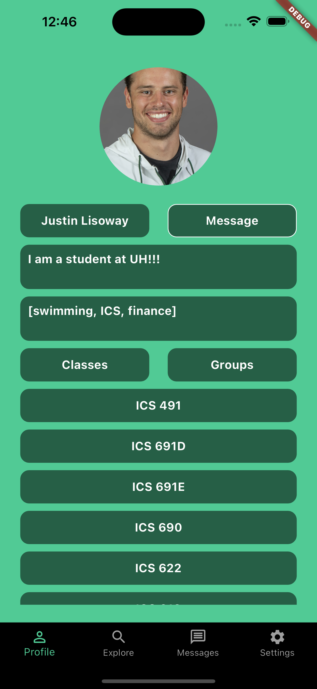
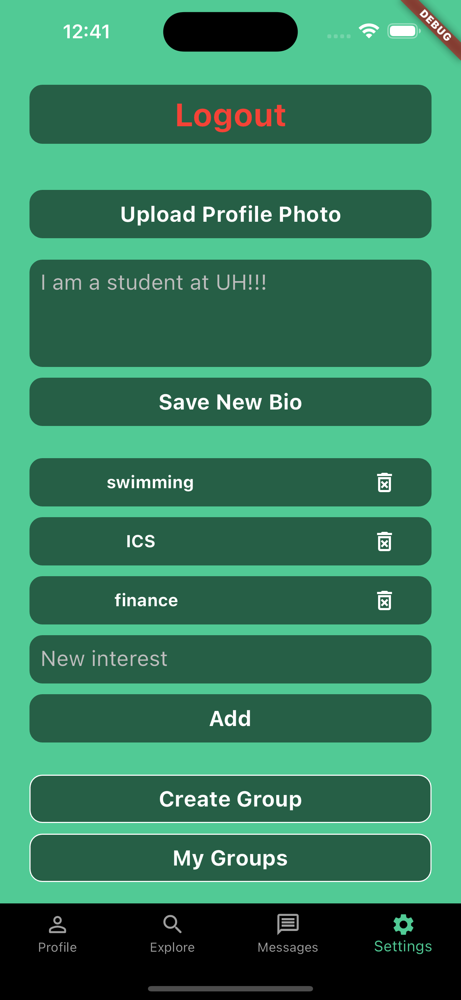

  
  

The University of Hawaii is lacking a student body directory for making connections on campus. The current system on campus is called Laulima and is clunky, slow, and only usable on a desktop machine. To change this, I set out to build a mobile and web app that carries and builds upon the current campus connection utility of Laulima. This app includes class lists, a group directory, and student directory. Anyone on campus can signup and have their information included in the database. Anyone signed up can search for classes, students, or groups and browse others' profile pages or start a group of their own. My hope is that students new to campus will find it easier to assimilate into campus life using my app, and current influential students will more easily be able to organize activities on campus, enriching the student experience at UH Manoa.

This app is currently deployed via Apple's Test Flight. An initial user evaluation has taken place, which provided valuable feedback. The project is on going in repsonse to this feedback, and key integration into the university's class database is planned to allow students to seamlessly register for the app.

[Source Code](https://github.com/UHM-Social-Software/app/tree/deployment)

You can learn more at the [Aloha Campus project website](https://uhm-social-software.github.io/).
