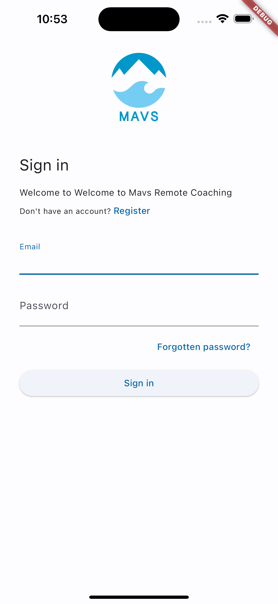
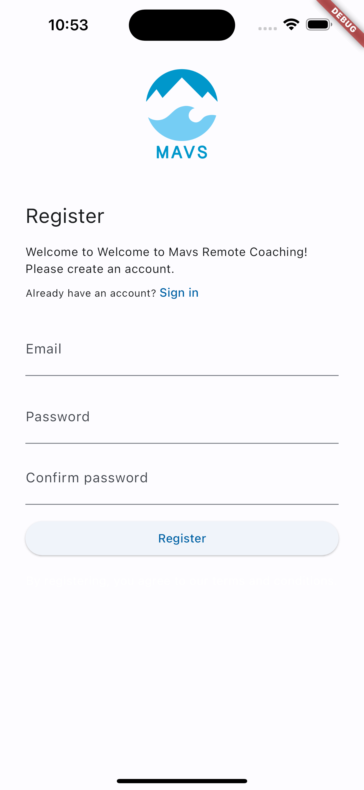
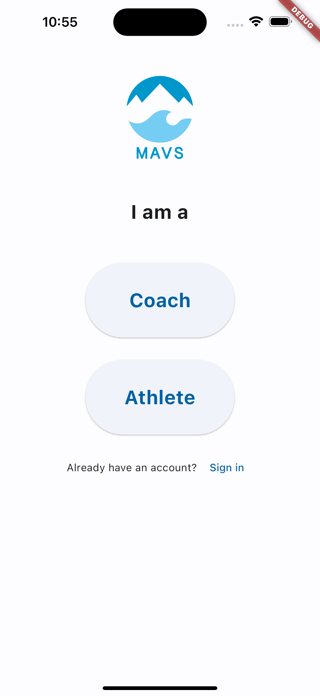
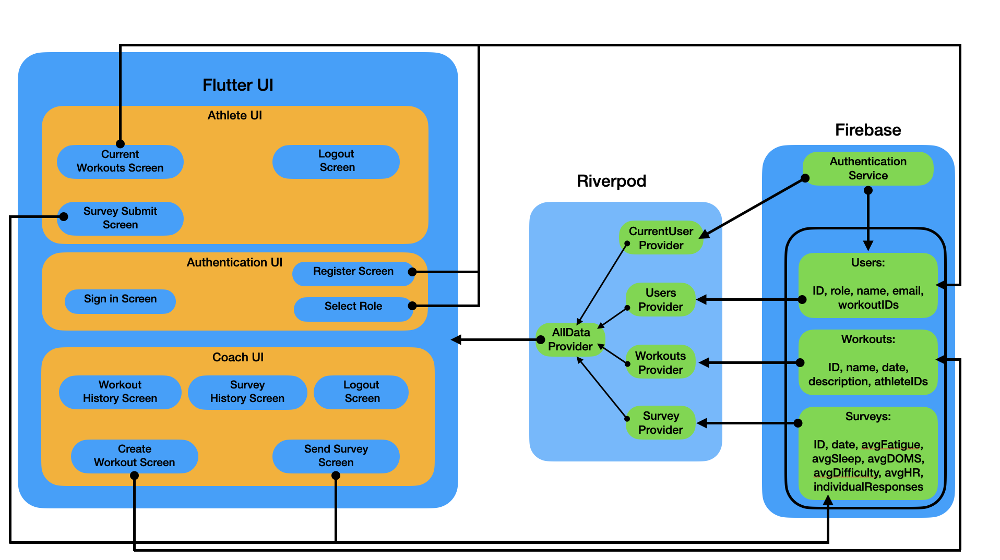

  
  
  

As part of my advanced software engineering course, I developed an app to help my client send swimming workouts and surveys to his athletes across the country and help him and his athletes keep track of historical workout and survey data.

Throughout the development of this mobile app, I used multiple software engineering best practices including:
 - version control
 - unit testing
 - requirement analysis
 - CI/CD pipeline
 - agile development
 - integrating user feedback

System Architecture:

  

  
The project was completed in approximatley 4 months and included 8 2-week sprints, each dedicated to the completion of 1 of 8 milestones. Each milestone built upon the last and aimed to bring the project one step closer to providing an MVP at the project's end, which satisfied all 3 initial success criteria provided by the client.

The most challenging feature of this project was learning the new technologies required to integrate flutter and firebase in order to properly handle authentication and user roles. However, the process was also extremely rewarding, as I was able to witness firsthand the positive reactions of my client all the way from the initial wireframing to the MVP. I was able to provide the client with a functional app that satisfied his success criteria at minimal cost to the client, and did so in 16 weeks.

[Source Code](https://github.com/Coaching-Software/app/tree/deployment)

You can learn more at the [Coaching App project website](https://coaching-software.github.io/).
