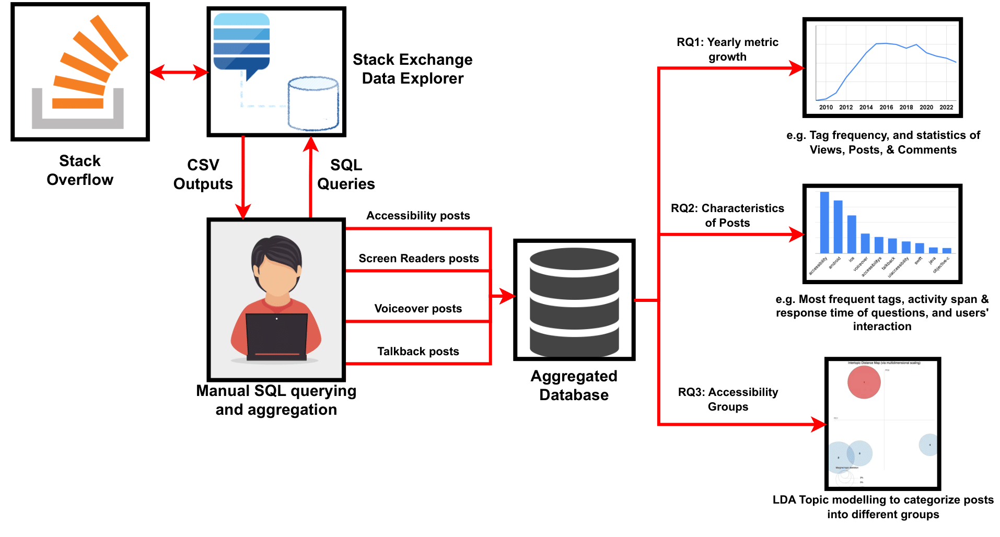
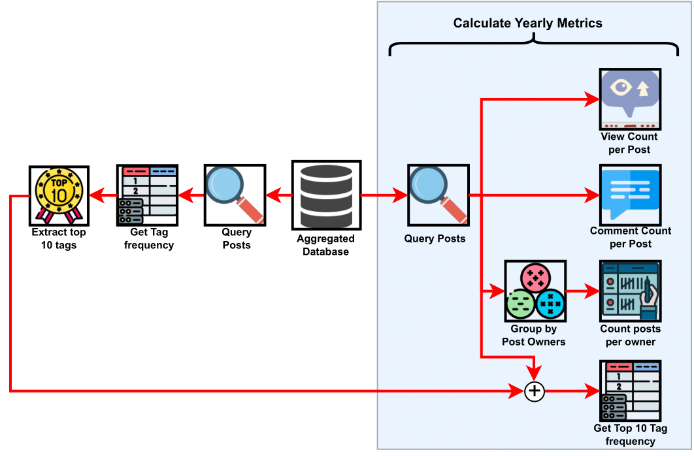
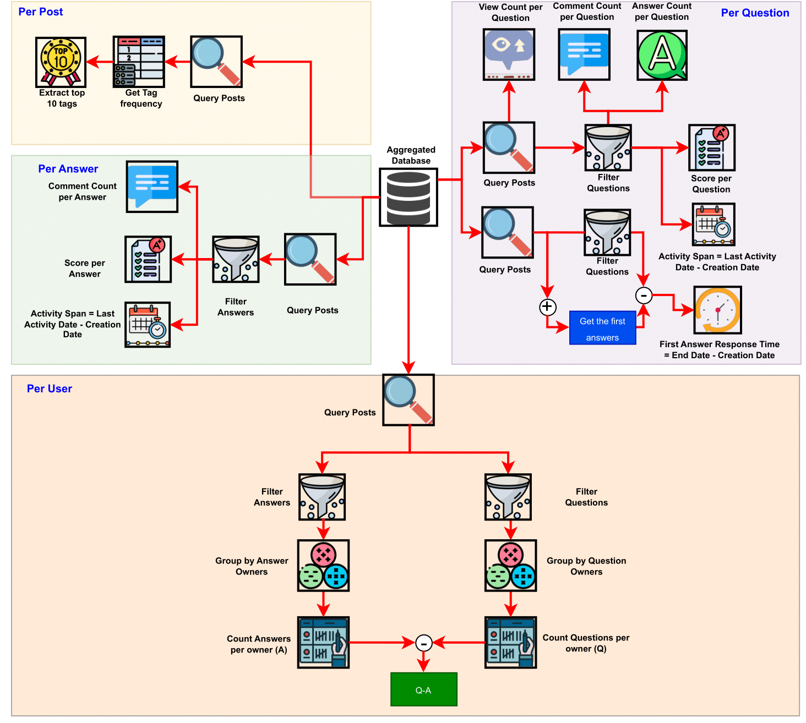
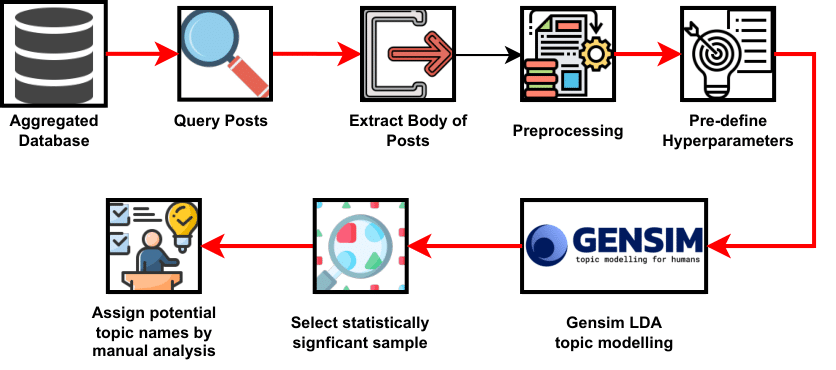

I co-authored a study on the mobile accessibility challenges faced by mobile app developers on Android and iOS devices. Our research team mined and processed thousands of Stack Overflow posts to answer 3 research questions regarding the state of mobile app accessibility features. The bulk of this study took place over 4 months, after several revisions, the final paper was published in the HICSS conference. Our abstract, method figures, and link to the published paper are provided below.

Abstract:

The proliferation of mobile applications (apps) has made it crucial to ensure their accessibility for users with disabilities. However, there is a lack of research on the real-world challenges developers face in implementing mobile accessibility features. This study presents a large-scale empirical analysis of accessibility discussions on Stack Overflow to identify the trends and challenges Android and iOS developers face. We examine the growth patterns, characteristics, and common topics mobile developers discuss. Our results show several challenges, including integrating assistive technologies like screen readers, ensuring accessible UI design, supporting text-to-speech across languages, handling complex gestures, and conducting accessibility testing. We envision our findings driving improvements in developer practices, research directions, tool support, and educational resources.

- RQ1: How have mobile app accessibility questions on Stack Overflow grown over the years? 
- RQ2: What are the characteristics of mobile app accessibility questions on Stack Overflow? 
- RQ3: What are the challenges associated with mobile app accessibility development? 

Stack Overflow mining method:

  

RQ1 Method:

  

RQ2 Method:

  

RQ3 Method:

  

You can also read the currently unpublished paper [here](https://arxiv.org/pdf/2409.07945).
