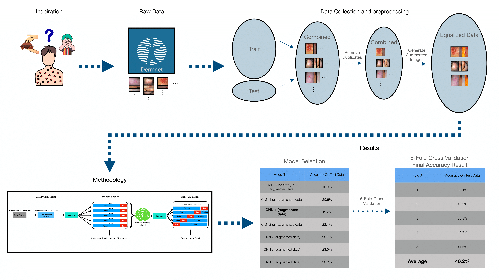

Project Infographic:

    

    

As part of my data science class, I collected and preprocessed thousands of images sourced from DermNet of 23 skin diseases, then fine tuned a CNN (convolutional neural network) model to classify any image of a skin condition into 1 of 23 given categories. The final model acheived 40% accuracy on the test data.

To dive futher into this project, check out my [source code](https://github.com/JustinLisoway/Skin_Disease_Detection_ML) or watch my [video summary](https://www.youtube.com/watch?v=YsgPvooVUF4).
